# Design Patterns For iOS Development

_This article is informative and does not have the purpose to strictly force developers to follow this patterns for the development of real iOS applications. However, it might be a good idea to understand them and considering using them for your particular problems._

### Types of Design Patterns.

1. **Structural**: Describe how objects are combined and composed to create complex structures. 
- MVC
- MVVM

2. **Behavioral**: Describe how objects communicate with each other.
- Delegation
- Strategy
- Observer

3. **Creational**: Describe how to create or instantiate objects.
- Builder
- Singleton
- Prototype

---
## Class Diagrams

As in this article, class diagrams are very useful for understanding Design patterns, so let's go through the require concepts that you already might be familiar with.

Class Diagrams include Classes, protocols, properties, methods and relationships.

Here is a class that we called Dog and a subclass SheepDog, in a class diagrams instead of saying _SheepDog inherits from Dog_ we can simply say _SheepDog is a Dog_. Makes sense right? The direction of the arrow defines de relationship. The arrows always point at the super class.

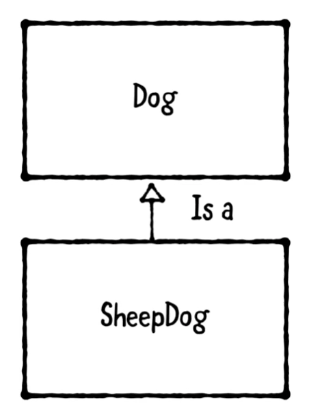 

To indicate that a class has a property, we can use a plain arrow and it would be read as "has a". If there are multiple properties it could be read as "has one or more.."

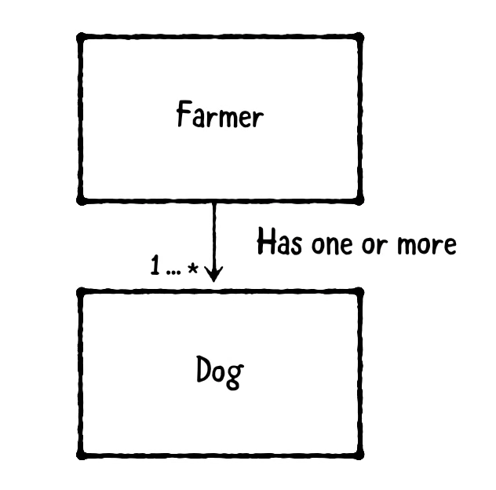 

Also, we could indicate multiple relationships in a single diagram.

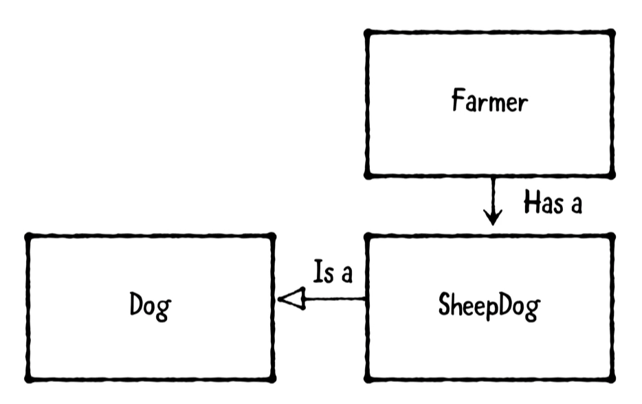 

Now, when we define a protocol, the right way would be adding a label "Protocol" surrounded by double brackets. 

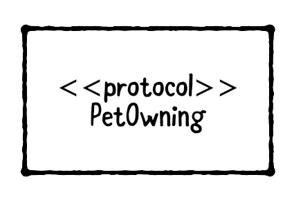 

This is the way we could add a class diagram to define a class that implements OR conforms to a protocol. 

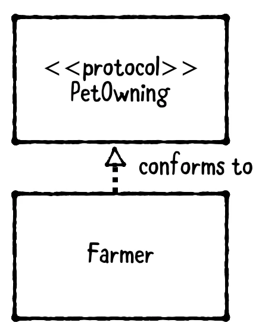 

But hold on. If we want to indicate "uses", we use a plain arrow and a dashed line. This is a relationship for **usage**, which means that indicates its purpose. 

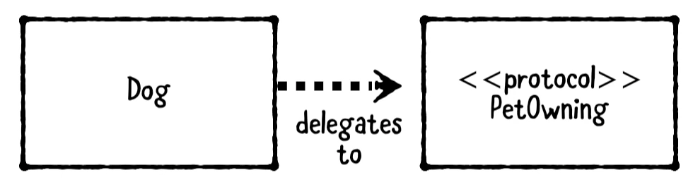 

We can add also add methods and properties in a class diagram.

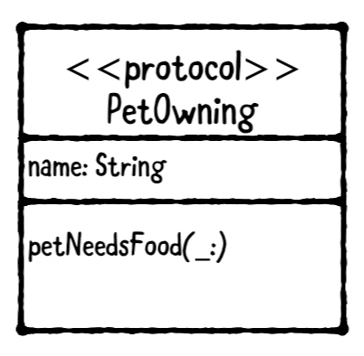 

Here it is a complete class diagram for a Farmer who has a SheepDog which is a Dog that delegates to the PetOwning object.

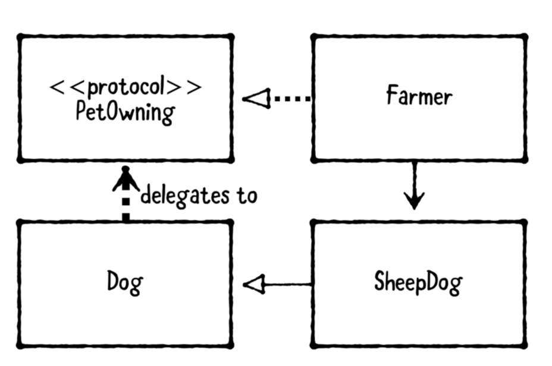 

### Other Examples

1. Dog and Cat inherit from Animal, which defines an eat method.

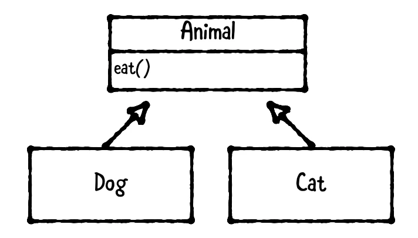 

2. Vehicle protocol has one Motor and one or more Wheel objects. Note that since the vehicle has one or more wheels an 1...* is added.

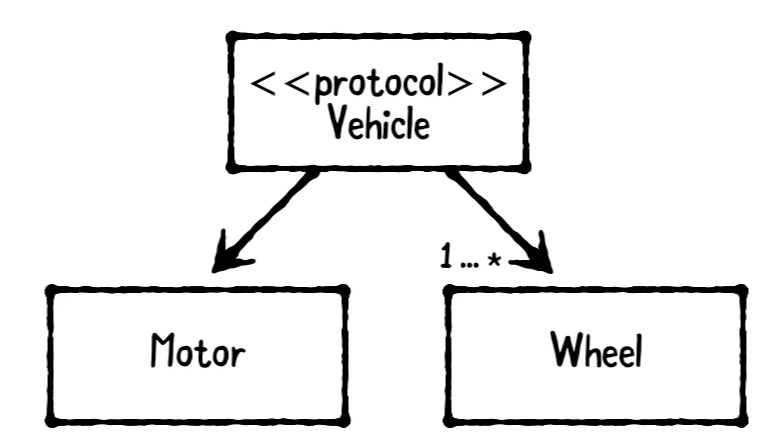 

3. Professor is a teacher and conforms to a Person protocol. This is a bit ambiguous, so there could be two options. In the option 1 the Professor conforms to Person and Teacher also conforms to Person. In Option 2 Teacher does not conforms to Person.

Option 1 | Option 2
------------ | -------------
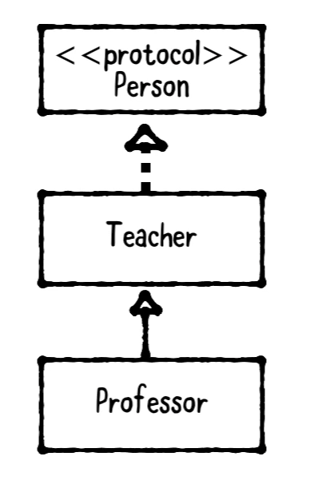  | 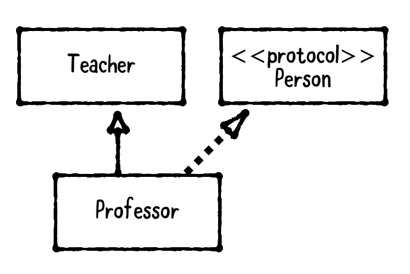 

---
## MVC (Model-View-Controller)

The MVC separates data into 3 types:

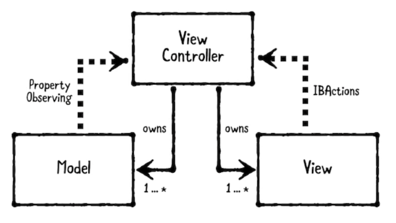 
<pre>
MVC is the Apple design pattern in the UIKit.
</pre>

- **Model**: Models hold onto application data. Usually Structs or simple classes.
- **Views**: Display visual elements and controls on the screen. Usually subclasses of UIView.
- **Controller**: Coordinates between Model and Views. Usually subclasses of UIViewController.

### Some rules
* Controllers are allowed to hold strong properties for the Model or View so they can access directly.
* Controllers might have one or more Models and/or Views.
* Models and Views should not hold a strong reference of the ViewController. Instead Model communicate to the Controllers through Property Observers and Views communicate to Controller by IBActions. 
* Models and Views are meant to be reusable, but Controllers not because Controllers have specific logic.

The following is a basic example where we illustrate what has been said. The Model is a basic struct that holds the data. A view could be any subclass of UIView, it is reusable. The View Controller holds a strong reference of the Model and the View, but no one owns it. The communication between the components is clear. The controller modifies the view and the model directly. The View talks to the Controller by IBActions, the View Could talk to the Controller by observers or delegates, but it will come later in this article.

```swift
// MARK: - Model
public struct Address {
  public var street: String
  public var city: String
  public var state: String
  public var zipCode: String
}

// MARK: - View
public final class AddressView: UIView {
  @IBOutlet public var streetTextField: UITextField!
  @IBOutlet public var cityTextField: UITextField!
  @IBOutlet public var stateTextField: UITextField!
  @IBOutlet public var zipCodeTextField: UITextField!
}

// MARK: - Controller
public final class AddressViewController: UIViewController {
  
  // MARK: - Properties
  public var address: Address? {
    didSet {
      updateViewFromAddress()
    }
  }
  public var addressView: AddressView! {
    guard isViewLoaded else { return nil }
    return (view as! AddressView)
  }
  
  // MARK: - View Lifecycle
  public override func viewDidLoad() {
    super.viewDidLoad()
    updateViewFromAddress()
  }
  
  private func updateViewFromAddress() {
    guard let addressView = addressView,
      let address = address else { return }
    addressView.streetTextField.text = address.street
    addressView.cityTextField.text = address.city
    addressView.stateTextField.text = address.state
    addressView.zipCodeTextField.text = address.zipCode
  }
  
  // MARK: - Actions
  @IBAction public func updateAddressFromView(_ sender: AnyObject) {
    guard let street = addressView.streetTextField.text, street.count > 0,
      let city = addressView.cityTextField.text, city.count > 0,
      let state = addressView.stateTextField.text, state.count > 0,
      let zipCode = addressView.zipCodeTextField.text, zipCode.count > 0
      else {
        // TO-DO: show an error message, handle the error, etc
        return
    }
    address = Address(street: street, city: city,
                      state: state, zipCode: zipCode)
  }
}

```

### Considerations

```
- Not every object fits into Model, View or Controller.
- Be careful about controllers growing too big.
- Use other patterns as needed.
```
---
## Delegation Pattern

<pre>
🥎 This pattern enables an object to use another helper object to provide data or perform a task rather than doing it itself.
🥎 The core purpose of the delegate pattern is to allow an object to communicate back to its owner in a decoupled way. By not requiring an object to know the concrete type of its owner, we can write code that is much easier to reuse and maintain.
</pre>

The delegation pattern has 3 parts:
- **Delegating Object:** The object that has the Delegate. The delegate is usually held in the delegating object as **weak property** to avoid a retain cycle where the delegating object retains the delegate which retains the delegating object.
- **Delegate Protocol:** Defines the methods that the Delegate might implement. 
- **Delegate:** The Helper Object that implements the Delegate Protocol.

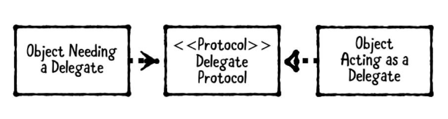 

### Basic example
```swift
// MARK: - Delegate
public class MainViewController: UIViewController {
    public override func viewDidLoad() {
        // Instantiate a MainViewController
        let vc = MenuViewController()
        vc.delegate = self
        navigationController?.pushViewController(vc, animated: true)
    }
}
extension MainViewController: MenuViewControllerDelegate {
    public func menuViewController(didRequestAFavour index: Int) {
        // Here I use index and do some task for MenuViewController.
    }
}

// MARK: - Delegate Protocol
public protocol MenuViewControllerDelegate: class {
    func menuViewController(didRequestAFavour index: Int)
}

// MARK: - Delegating Object
public class MenuViewController: UIViewController {

  public weak var delegate: MenuViewControllerDelegate?

  @IBAction public func updateAddressFromView(_ sender: AnyObject) {
    delegate?.menuViewController(didRequestAFavour: 1)
  }
}
```

### When should we use it?

1. To break up large classes or create reusable components.
2. In Apple frameworks datasources and delagates both use this pattern. (FYI, Datasources have delegate methods to **provide** data and delegates have delegates methods that **receive** data).
---
## Strategy Pattern

<pre>
🥎 This pattern defines a family of interchangeable objects that can be set or switch at runtime.
🥎 This pattern is similar to the Delegate pattern but, instead of defining one delegate we have a family of objects.
</pre>

 

This pattern has 3 parts.

1. **The object using the strategy:** Usually is a ViewController or any class that requires interchangeable behavior.
2. **Strategy Protocol:** Protocol that define the methods of the strategy.
3. **Strategies:** Objects that conform to the Strategy Protocol.

### When should we use it?

- When we have two or more interchangeable behaviors.
- When we need to interchange them at runtime.

### Basic Example

The following example shows this pattern in action, basically the strategies are helper classes that conform to the same protocol which means that the protocol methods will be the same but the logic in each strategy is different according to the needs. 

```swift
// MARK: - Strategy Protocol
public protocol MovieRatingStrategy {
  
  var ratingServiceName: String { get }
  
  func fetchRating(for movieTitle: String,
                   success: (_ rating: String, _ review: String) -> ())
}

// MARK: - Strategy 1
public class RottenTomatoesClient: MovieRatingStrategy {
  public let ratingServiceName = "Rotten Tomatoes"
  
  public func fetchRating(
    for movieTitle: String,
    success: (_ rating: String, _ review: String) -> ()) {
    
    // In a real service, you'd make a network request...
    // Here, we just provide dummy values...
    let rating = "95%"
    let review = "It rocked!"
    success(rating, review)
  }
}

// MARK: - Strategy 2
public class IMDbClient: MovieRatingStrategy {
  public let ratingServiceName = "IMDb"
  
  public func fetchRating(
    for movieTitle: String,
    success: (_ rating: String, _ review: String) -> ()) {
    
    let rating = "3 / 10"
    let review = """
      It was terrible! The audience was throwing rotten
      tomatoes!
      """
    success(rating, review)
  }
}

import UIKit

// MARK: - Object Using the Strategy
public class MoviewRatingViewController: UIViewController {
  
  // MARK: - Properties
  public var movieRatingClient: MovieRatingStrategy!
  
  // MARK: - Outlets
  @IBOutlet public var movieTitleTextField: UITextField!
  @IBOutlet public var ratingServiceNameLabel: UILabel!
  @IBOutlet public var ratingLabel: UILabel!
  @IBOutlet public var reviewLabel: UILabel!
  
  // MARK: - View Lifecycle
  public override func viewDidLoad() {
    super.viewDidLoad()
    ratingServiceNameLabel.text =
      movieRatingClient.ratingServiceName
  }
  
  // MARK: - Actions
  @IBAction public func searchButtonPressed(sender: Any) {
    guard let movieTitle = movieTitleTextField.text
      else { return }
    
    movieRatingClient.fetchRating(for: movieTitle) {
      (rating, review) in
      self.ratingLabel.text = rating
      self.reviewLabel.text = review
    }
  }
}
```

---
## Singleton Pattern

<pre>
🥎 This pattern restricts a class to a single instance. Every reference to the class refers to the same underlined instance.
</pre>

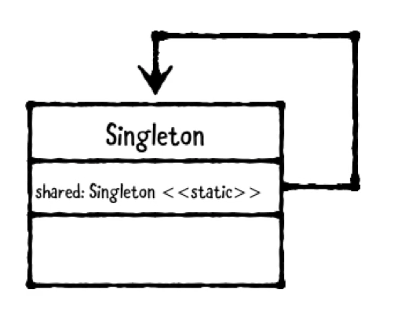 

### When should we use it?

- When it makes sense to have a shared instance of the same class alive all the time and available from any other class.
- Sometimes is useful to store states on memory while using the application and not on disk.
- Sometimes is useful to have share instance but with a bit of difference. In this case a singleton with custom instances capability could be created. This is called Singleton Plus.

### Basic Example

```swift
// MARK: - Singleton
public class MySingleton {
  static let shared = MySingleton()
  private init() { }
}

let mySingleton = MySingleton.shared


// MARK: - Singleton Plus

public class MySingletonPlus {
  static let shared = MySingletonPlus()
  public init() { }
}

let singletonPlus = MySingletonPlus.shared
let singletonPlus2 = MySingletonPlus()
```

### Cautions

- Be careful, this pattern is very easy to be overused. **Don't make it the first option to accomplish a task.**
- Don't use it for passing data.
- Singletons make testing harder.
- Be aware of "code smells" indicating you don't need a singleton.
- Singleton Plus might not be a good idea. Consider using simple class objects.
___

## Memento Pattern

<pre>
🥎 This pattern allows an object to be saved and restored.
</pre>

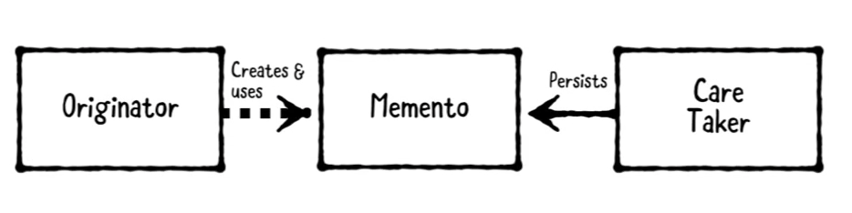 

This patters has 3 parts.
- **Originator:** Is the object to be saved or restored.
- **Memento:** Represents a stored state.
- **Care Taker:** Is responsible for persisting the memento and later on providing the memento back to the originator to restore the originator's state.

### Usage 

- Used to save and restore an object. For example, to implement a "save game" system.
- By persisting an array of mementos, undo/redo stacks can me implemented.

### Basic Example

```swift
// MARK: - Originator
public class Game: Codable {
  
  public class State: Codable {
    public var attemptsRemaining: Int = 3
    public var level: Int = 1
    public var score: Int = 0
  }
  public var state = State()
  
  public func rackUpMassivePoints() {
    state.score += 9002
  }
  
  public func monstersEatPlayer() {
    state.attemptsRemaining -= 1
  }
}

// MARK: - Memento
typealias GameMemento = Data

// MARK: - CareTaker
public class GameSystem {
  
  private let decoder = JSONDecoder()
  private let encoder = JSONEncoder()
  private let userDefaults = UserDefaults.standard
  
  public func save(_ game: Game, title: String) throws {
    let data = try encoder.encode(game)
    userDefaults.set(data, forKey: title)
  }
  
  public func load(title: String) throws -> Game {
    guard let data = userDefaults.data(forKey: title),
      let game = try? decoder.decode(Game.self, from: data)
      else {
        throw Error.gameNotFound
    }
    return game
  }
  
  public enum Error: String, Swift.Error {
    case gameNotFound
  }
}

// MARK: - Example
var game = Game()
game.monstersEatPlayer()
game.rackUpMassivePoints()

// Save Game
let gameSystem = GameSystem()
try gameSystem.save(game, title: "Best Game Ever")

// New Game
game = Game()
print("New Game Score: \(game.state.score)")

// Load Game
game = try! gameSystem.load(title: "Best Game Ever")
print("Loaded Game Score: \(game.state.score)")
```
___
## Observer Pattern

<pre>
🥎 This pattern allows an object to observe changes on another object. Apple added support for this pattern in Swift 5.1 with the additional Publisher in the Combine framework.
</pre>

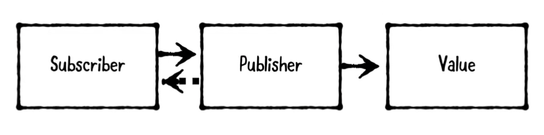 

These are the types involved in this pattern:
- **Subscriber:** The Observer object that receives updates.
- **Publisher:** The Observable object that sends updates.
- **Value:** The object that is changed.

### Basic Example

```swift
import Combine

// MARK: - Publisher
public class User {
    // MARK: - Value
    @Published var name: String
    public init(name: String) {
        self.name = name
    }
}

// MARK: - Subscriber
let user = User(name: "Ray")
let publisher = user.$name
var subscriber: AnyCancellable? = publisher.sink() {
    print("User's name is \($0)")
}

user.name = "Vicki"
// Set subscriber to nul to stop receiving changes
subscriber = nil
user.name = "Ray has left the building"
```
### Considerations
- @Published annotations can be added only in a class type.
- Don't use on simple models or properties that never change.
- Be sure about what to expect to change and when.
___
## Builder Pattern

<pre>
🥎 This pattern allows us to create complex objects by providing inputs step by step instead of requiring all the inputs upfront in the initializer.
🥎 Use it when building a product that requires multiple inputs. 
🥎 If the product does have several inputs or cannot be created step by step it is better to use convenient initializers with default values.
</pre>

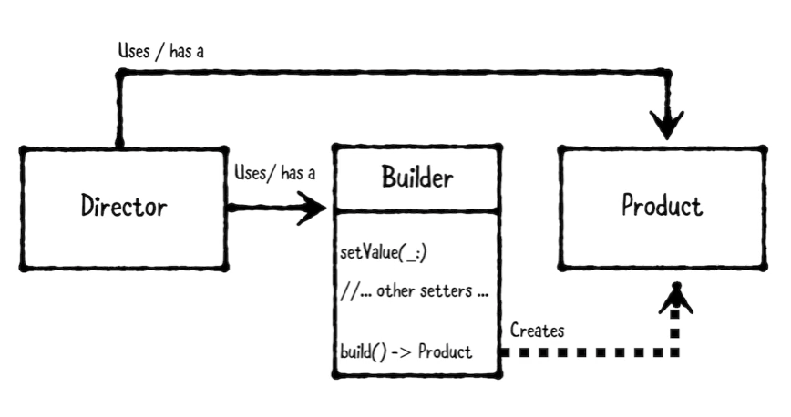 

This pattern involved 3 types.
- **Director:** Accepts inputs and coordinates with the builder. Usually a view controller or a helper class that is used by the view controller.
- **Product:** The complex object to be created. Could be a class or a struct.
- **Builder:** Accepts step by step inputs and handles the creations of the products.

### Basic Example

The following example shows this pattern in action for a hamburger builder where the director is a chef or employee and the product is a builder. The builder object is contains the logic required to deliver fresh and delicious hamburgers. In this way the hamburger object is isolated from the complex logic that required preparing a nice burger.

```swift
// MARK: - Product
public struct Hamburger {
  public let meat: Meat
  public let sauce: Sauces
  public let toppings: Toppings
}

extension Hamburger: CustomStringConvertible {
  public var description: String {
    return meat.rawValue + " burger"
  }
}

public enum Meat: String {
  case beef
  case chicken
  case kitten
  case tofu
}

public struct Sauces: OptionSet {
  public static let mayonnaise = Sauces(rawValue: 1 << 0)
  public static let mustard = Sauces(rawValue: 1 << 1)
  public static let ketchup = Sauces(rawValue: 1 << 2)
  public static let secret = Sauces(rawValue: 1 << 3)
  
  public let rawValue: Int
  public init(rawValue: Int) {
    self.rawValue = rawValue
  }
}

public struct Toppings: OptionSet {
  public static let cheese = Toppings(rawValue: 1 << 0)
  public static let lettuce = Toppings(rawValue: 1 << 1)
  public static let pickles = Toppings(rawValue: 1 << 2)
  public static let tomatoes = Toppings(rawValue: 1 << 3)
  
  public let rawValue: Int
  public init(rawValue: Int) {
    self.rawValue = rawValue
  }
}

// MARK: - Builder
public class HamburgerBuilder {
  
  public enum Error: Swift.Error {
    case soldOut
  }
  
  public private(set) var meat: Meat = .beef
  public private(set) var sauces: Sauces = []
  public private(set) var toppings: Toppings = []
  
  private var soldOutMeats: [Meat] = [.kitten]
  
  public func addSauces(_ sauce: Sauces) {
    sauces.insert(sauce)
  }
  
  public func removeSauces(_ sauce: Sauces) {
    sauces.remove(sauce)
  }
  
  public func addToppings(_ topping: Toppings) {
    toppings.insert(topping)
  }
  
  public func removeToppings(_ topping: Toppings) {
    toppings.remove(topping)
  }
  
  public func setMeat(_ meat: Meat) throws {
    guard isAvailable(meat) else { throw Error.soldOut }
    self.meat = meat
  }
  
  public func isAvailable(_ meat: Meat) -> Bool {
    return !soldOutMeats.contains(meat)
  }
  
  public func build() -> Hamburger {
    return Hamburger(meat: meat,
                     sauce: sauces,
                     toppings: toppings)
  }
}

// MARK: - Director
public class Employee {
  
  public func createCombo1() throws -> Hamburger {
    let builder = HamburgerBuilder()
    try builder.setMeat(.beef)
    builder.addSauces(.secret)
    builder.addToppings([.lettuce, .tomatoes, .pickles])
    return builder.build()
  }
  
  public func createKittenSpecial() throws -> Hamburger {
    let builder = HamburgerBuilder()
    try builder.setMeat(.kitten)
    builder.addSauces(.mustard)
    builder.addToppings([.lettuce, .tomatoes])
    return builder.build()
  }
}

// MARK: - Example
let burgerFlipper = Employee()

if let combo1 = try? burgerFlipper.createCombo1() {
  print("Nom nom " + combo1.description)
}

if let kittenBurger = try?
  burgerFlipper.createKittenSpecial() {
  print("Nom nom nom " + kittenBurger.description)
  
} else {
  print("Sorry, no kitten burgers here... :[")
}
```
___
## Model-View-View-Model Pattern (MVVM)

<pre>
🥎 MVVM can be also applied as structural pattern in iOS to separate the UI from the logic.
🥎 This pattern complements MVC well by moving transformation logic out of the view controllers.
</pre>

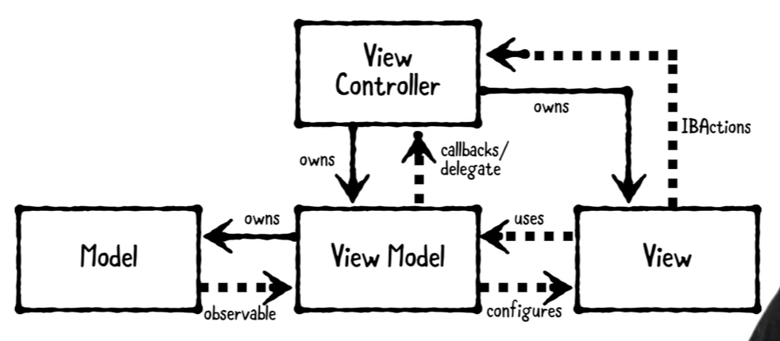 

Objects are separated into three distinct groups:
- **Model:** Hold on to app data. Usually structs or simple classes.
- **View:** Views display visual elements on the screen. Usually subclasses of UIView.
- **ViewModel:** Transform model information into values that can be displayed on a view. Usually classes that can be passed as references.

### Considerations
- Use it when transformation of models into view representation is required.
- This is a powerful pattern widely used on real iOS application. Nevertheless, it is highly recommended to use it with other patterns in real applications. 

### Basic Example
The following is a simple example of MVVM pattern, in it we can see how the data to display is obtained in the view model.

```swift
import PlaygroundSupport
import UIKit

// MARK: - Model
public class PersonalInfo {
    public let birthDate: Date
    init(birthDate: Date) {
        self.birthDate = birthDate
    }
}

// MARK: - ViewModel
public class PersonViewModel {
    private let calendar: Calendar
    private let personalInfo: PersonalInfo
    public init(personalInfo: PersonalInfo,
                calendar: Calendar = Calendar(identifier: .gregorian)) {
      self.personalInfo = personalInfo
      self.calendar = calendar
    }
    
    public var ageText: String {
      let today = calendar.startOfDay(for: Date())
        let birthday = calendar.startOfDay(for: personalInfo.birthDate)
      let components = calendar.dateComponents([.year], from: birthday, to: today)
      let age = components.year!
      return "\(age) years old"
    }
}

extension PersonViewModel {
  public func configure(_ view: PersonView) {
    view.ageLabel.text = ageText
  }
}

// MARK: - View
public class PersonView: UIView {
  public let ageLabel: UILabel
  
  public override init(frame: CGRect) {
    let childFrame = CGRect(x: 0.0, y: 16.0,
                            width: frame.width, height: frame.height / 2)
    ageLabel = UILabel(frame: childFrame)
    ageLabel.textAlignment = .center
    super.init(frame: frame)
    backgroundColor = .white
    addSubview(ageLabel)
  }
  
  @available(*, unavailable)
  public required init?(coder: NSCoder) {
    fatalError("Use init(frame:) instead")
  }
}

// MARK: - Example
let birthday = Date(timeIntervalSinceNow: -2 * 86400 * 366)
let info = PersonalInfo(birthDate: birthday)
let viewModel = PersonViewModel(personalInfo: info)
let frame = CGRect(x: 0.0, y: 0.0, width: 300.0, height: 420.0)
let view = PersonView(frame: frame)
viewModel.configure(view)
PlaygroundPage.current.liveView = view
```

___
## Factory pattern

<pre>
🥎 This patterns allows creation of objects without exposing the creation logic.
</pre>

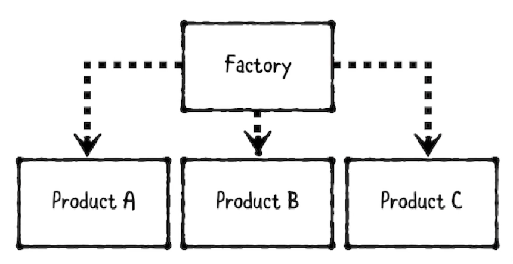 

This pattern involves two types:
- **Factory:** Responsible of creating objects.
- **Product:** The objects thar are being created.

### When to use it?
- When we want to separate product creation logic, instead of having consumers create products directly.
- It is useful when we have a group of related products such as polymorphic subclasses or several objects that implement the same protocol.
- If the creation of an object requires a series of steps.

### Basic Example
```swift
public struct JobApplicant {
  public enum Status {
    case new
    case interview
    case hired
    case rejected
  }
  public let name: String
  public let email: String
  public var status: Status
}

public struct Email {
  public let subject: String
  public let messageBody: String
  public let recipientEmail: String
  public let senderEmail: String
}

public struct EmailFactory {
  public let senderEmail: String
  
  public func createEmail(to recipient: JobApplicant) -> Email {
    let subject: String
    let messageBody: String
    switch recipient.status {
    case .new:
      subject = "We Received Your Application"
      messageBody = "Thanks for applying for a job here! " +
        "You should hear from us in 17-42 business days."
      
    case .interview:
      subject = "We Want to Interview You"
      messageBody = "Thanks for your resume, \(recipient.name)! " +
        "Can you come in for an interview in 30 minutes?"
      
    case .hired:
      subject = "We Want to Hire You"
      messageBody = "Congratulations, \(recipient.name)! " +
        "We liked your code, and you smelled nice. " +
        "We want to offer you a position! Cha-ching! $$$"
      
    case .rejected:
      subject = "Thanks for Your Application"
      messageBody = "Thank you for applying, \(recipient.name)! " +
        "We have decided to move forward with other candidates. " +
        "Please remember to wear pants next time!"
    }
    return Email(subject: subject,
                 messageBody: messageBody,
                 recipientEmail: recipient.email,
                 senderEmail: senderEmail)
  }
}

// Example
var jackson = JobApplicant(name: "Jackson Smith",
                           email: "jackson.smith@example.com",
                           status: .new)
let emailFactory = EmailFactory(senderEmail: "RaysMinions@RayWenderlich.com")
print(emailFactory.createEmail(to: jackson), "\n")

jackson.status = .interview
print(emailFactory.createEmail(to: jackson), "\n")

jackson.status = .hired
print(emailFactory.createEmail(to: jackson), "\n")
```
### Considerations
- If the objects are very simple it is not worth to use this pattern. Instead, it could be created directly in the consumer.

___
## Adapter pattern

<pre>
🥎 This patterns is a behavioral pattern that allows incompatible types to work together.
</pre>

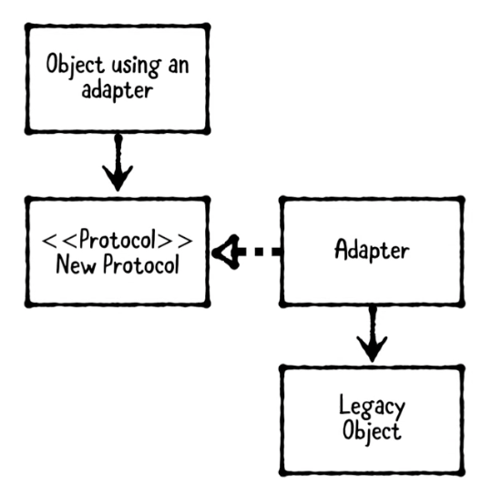 

This pattern involves four components:
- **Object using the adapter:** Depends on the new protocol.
- **New Protocol:** The desired protocol to use. 
- **Adapter:** What is created to conform the protocol. It passes calls onto the legacy object.
- **Legacy Object:** Existed before the protocol was made and cannot be directly modified to conform to the new protocol.

### When to use it?
- When we cannot modified a class. Especially if it comes from a library.
<pre>
We can create an adapter by using an extension ot a new adapter class.
</pre>

### Basic Example

```swift
// MARK: - Legacy Object
public class GoogleAuthenticator {
  
  public func login(email: String,
                    password: String,
                    completion: @escaping (GoogleUser?, Error?) -> Void) {
    // Make networking calls, which return a special "token"
    let token = "special-token-value"
    let user = GoogleUser(email: email, password: password, token: token)
    completion(user, nil)
  }
}

public struct GoogleUser {
  public var email: String
  public var password: String
  public var token: String
}

// MARK: - New Protocol
public protocol AuthenticationService {
  func login(email: String,
             password: String,
             success: @escaping (User, Token) -> Void,
             failure: @escaping (Error?) -> Void)
}

public struct User {
  public let email: String
  public let password: String
}

public struct Token {
  public let value: String
}

// MARK: - Adapter
public class GoogleAuthenticatorAdapter: AuthenticationService {
  
  private var authenticator = GoogleAuthenticator()
  
  public func login(email: String,
                    password: String,
                    success: @escaping (User, Token) -> Void,
                    failure: @escaping (Error?) -> Void) {
    authenticator.login(email: email, password: password) { (googleUser, error) in
      guard let googleUser = googleUser else {
        failure(error)
        return
      }
      let user = User(email: email, password: password)
      let token = Token(value: googleUser.token)
      success(user, token)
    }
  }
}

// MARK: Object Using the adapter
let authService: AuthenticationService = GoogleAuthenticatorAdapter()

authService.login(
  email: "user@example.com",
  password: "password",
  success: {user, token in
    print("Auth succeeded: \(user.email), \(token.value)")
                    
}, failure: {error in
  if let error = error {
    print("Auth failed with error: \(error)")
  } else {
    print("Auth failed with no error provided")
  }
})
```

___
## Iterator pattern

<pre>
🥎 This patterns is a behavioral pattern provides a standard way to loop through collections.
</pre>

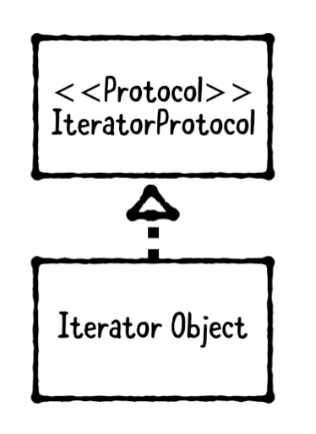 

This pattern involves four components:
- **Swift Iterable Protocol:** Type than can be iterated using a for loop.
- **Iterator Object:** A custom object you want to make iterable. Instead of conforming to Iterable directly, however, you can conform to Sequence, which itself conforms to Iterable. By doing so, you'll get many higher-order functions, including map, filter and more, implemented for free for you.

### When to use it?
- When we have a class or struct that holds a group of objects and we need to iterate by using a **for in loop**.
<pre>
Prefer to use the Sequence protocol to get higher order functions for free.
</pre>

### Basic Example

The following example shows the usage of this pattern. The **Swift Iterable Protocol** is the protocol _Sequence_ and the **Iterator Object** is Queue.

```swift
public struct Queue<T> {
  private var array: [T?] = []
  private var head = 0
  
  public var isEmpty: Bool {
    return count == 0
  }
  public var count: Int {
    return array.count - head
  }
  public mutating func enqueue(_ element: T) {
    array.append(element)
  }
  public mutating func dequeue() -> T? {
    guard head < array.count,
      let element = array[head] else {
        return nil
    }
    array[head] = nil
    head += 1
    let percentage = Double(head)/Double(array.count)
    if array.count > 50,
      percentage > 0.25 {
      array.removeFirst(head)
      head = 0
    }
    return element
  }
}
extension Queue: Sequence {
  public func makeIterator() -> IndexingIterator<Array<T>> {
    let nonEmptyValues = Array(array[head ..< array.count]) as! [T]
    return nonEmptyValues.makeIterator()
  }
}

public struct Ticket {
  enum PriorityType {
    case low
    case medium
    case high
  }
  var description: String
  var priority: PriorityType
}
extension Ticket {
  var sortIndex: Int {
    switch self.priority {
    case .low: return 0
    case .medium: return 1
    case .high: return 2
    }
  }
}

var queue = Queue<Ticket>()
queue.enqueue(Ticket(description: "Wireframe Tinder for dogs", priority: .low))
queue.enqueue(Ticket(description: "Set up 4k monitor", priority: .medium))
queue.enqueue(Ticket(description: "There is smoke coming out of my computer",
                     priority: .high))
queue.enqueue(Ticket(description: "Put googly eyes on roomba", priority: .low))

print("List of Tickets in queue:")
for ticket in queue {
  print(ticket.description)
}

let sortedTickets = queue.sorted {
  $0.sortIndex > $1.sortIndex
}
print("\nSorted Tickets in queue:")
for ticket in sortedTickets {
  print(ticket.description)
}
```

Read more about it. https://developer.apple.com/documentation/swift/iteratorprotocol


___
## Prototype pattern

<pre>
🥎 This pattern is a creational pattern that allows an object to copy itself.
</pre>

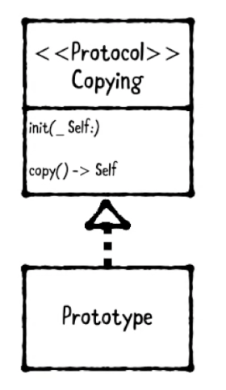 

This pattern involves two types:
- **Copying Protocol:** Declares copy methods.
- **Prototype:** Conforms to the Copying protocol.

There are two types of copies: Shallow and Deep.
- Shallow: Creates a new object instance but does not copy its properties. Like when coping a reference type.
- Deep: Creates a new object instance including copy of its properties.

<pre>
FYI

<em style="color: green;">Reference types</em>
They are not copied when they are assigned to a variable constant, or when passed to a function. Rather than a copy, a reference to the same existing instance is used.
<strong style="color: yellow;">Classes are reference types.</strong>

<em style="color: green;">Value types</em>
Is a type whose value is copied when it's assigned to a variable constant, or when it's passed to a function as parameter. 
<strong style="color: yellow;">Structs and Enums are value types.</strong>
</pre>

### When yo use this pattern?
- When we need to enable an object to copy itself. NSCoping is not great in Swift. Sometimes creating our own copying protocol would be more swift-y.

### Basic Example
The following example show how can we make our own Copying protocol and implement a custom copy mechanism. 
<pre>
It isn't a good idea to allow create instances from other instances where force casting is required. See example.
</pre>


```swift
// MARK:- Copying Protocol
public protocol Copying: class {
  init(_ prototype: Self)
}
extension Copying {
  public func copy() -> Self {
    return type(of: self).init(self)
  }
}

public class Monster: Copying {
  public var health: Int
  public var level: Int
  public init(health: Int, level: Int) {
    self.health = health
    self.level = level
  }
  public required convenience init(_ prototype: Monster) {
    self.init(health: prototype.health, level: prototype.level)
  }
}

public class EyeballMonster: Monster {
  public var redness = 0
  public override convenience init(health: Int, level: Int) {
    self.init(health: health, level: level, redness: 0)
  }
  public init(health: Int, level: Int, redness: Int) {
    self.redness = redness
    super.init(health: health, level: level)
  }
  
  @available(*, unavailable, message: "Call copy() instead")
  public required convenience init(_ prototype: Monster) {
    let eyeballMonster = prototype as! EyeballMonster
    self.init(health: eyeballMonster.health,
              level: eyeballMonster.level,
              redness: eyeballMonster.redness)
  }
}

let monster = Monster(health: 700, level: 37)
let monster2 = monster.copy()
print("Watch out! That monster's level is \(monster2.level)")

let eyeball = EyeballMonster(health: 3002, level: 60, redness: 999)
let eyeball2 = eyeball.copy()
print("Eww! It's eyeball redness is \(eyeball2.redness)!")

let eyeballMonster3 = EyeballMonster(monster)
```

___
## State pattern

<pre>
🥎 This pattern is a behavioral pattern that allows an object to change its behavior on runtime.
</pre>

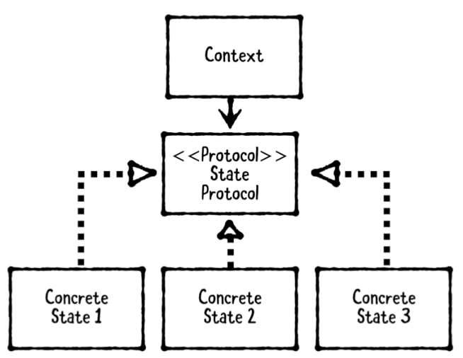 

This pattern involves three types:
- **Context:** Is the object that has a current state and whose behavior changes.
- **State Protocol:** Defines required methods and properties. 
- **Concrete State:** Conforms to the state protocol. The context holds onto its current state but it doesn't know it is a 'concrete state' type. Instead the context uses behavior using polymorphism. Concrete states defines how the context should act. If we need a new behavior we define a new Concrete State.

### When should we use this pattern?

- When we have a system with two or more states that change during its lifetime. States can close sets (Like traffic lights) or open sets (Like animations etc.)  

<pre>
On this pattern states can be switch with polymorphism and we wouldn't need to use Switch or if/else statements.
</pre>

### Basic Example

```swift
import UIKit
import PlaygroundSupport

// MARK: - Context
public class TrafficLight: UIView {
  public private(set) var canisterLayers: [CAShapeLayer] = []
  public private(set) var currentState: TrafficLightState
  public private(set) var states: [TrafficLightState]
  
  public var nextState: TrafficLightState {
    guard let index = states.firstIndex(where: { $0 === currentState}),
      index + 1 < states.count else {
        return states.first!
    }
    return states[index + 1]
  }
  
  @available(*, unavailable)
  public required init?(coder: NSCoder) {
    fatalError()
  }
  
  public init(canisterCount: Int = 3,
              frame: CGRect = CGRect(x: 0, y: 0, width: 160, height: 420),
              states: [TrafficLightState]) {
    guard !states.isEmpty else {
      fatalError()
    }
    self.currentState = states.first!
    self.states = states
    super.init(frame: frame)
    backgroundColor = UIColor(red: 0.86, green: 0.64, blue: 0.25, alpha: 1)
    createCanisterLayers(count: canisterCount)
    transition(to: currentState)
  }
  
  private func createCanisterLayers(count: Int) {
    let paddingPercentage: CGFloat = 0.2
    let yTotalPadding = paddingPercentage * bounds.height
    let yPadding = yTotalPadding / CGFloat(count + 1)
    
    let canisterHeight = (bounds.height - yTotalPadding) / CGFloat(count)
    let xPadding = (bounds.width - canisterHeight) / 2.0
    var canisterFrame = CGRect(x: xPadding, y: yPadding,
                               width: canisterHeight, height: canisterHeight)
    
    for _ in 0 ..< count {
      let canisterShape = CAShapeLayer()
      canisterShape.path = UIBezierPath(ovalIn: canisterFrame).cgPath
      canisterShape.fillColor = UIColor.black.cgColor
      layer.addSublayer(canisterShape)
      canisterLayers.append(canisterShape)
      canisterFrame.origin.y += (canisterFrame.height + yPadding)
    }
  }
  
  // Use to transit between states.
  public func transition(to state: TrafficLightState) {
    removeCanisterSublayers()
    currentState = state
    currentState.apply(to: self)
    nextState.apply(to: self, after: currentState.delay)
  }
  
  private func removeCanisterSublayers() {
    canisterLayers.forEach { $0.sublayers?.forEach { $0.removeFromSuperlayer() } }
  }
}

// MARK: - State Protocol
public protocol TrafficLightState: class {
  var delay: TimeInterval { get }
  
  func apply(to context: TrafficLight)
}
extension TrafficLightState {
  public func apply(to context: TrafficLight, after delay: TimeInterval) {
    let queue = DispatchQueue.main
    let dispatchTime = DispatchTime.now() + delay
    queue.asyncAfter(deadline: dispatchTime) { [weak self, weak context] in
      guard let self = self, let context = context else { return }
      context.transition(to: self)
    }
  }
}

// MARK: - Concrete States
/*
 Access the traffic light's canister light itself.
 */
public class SolidTrafficLightState {
  public let canisterIndex: Int
  public let color: UIColor
  public let delay: TimeInterval
  
  public init(canisterIndex: Int,
              color: UIColor,
              delay: TimeInterval) {
    self.canisterIndex = canisterIndex
    self.color = color
    self.delay = delay
  }
}


extension SolidTrafficLightState: TrafficLightState {
  public func apply(to context: TrafficLight) {
    let canisterLayer = context.canisterLayers[canisterIndex]
    let circleShape = CAShapeLayer()
    circleShape.path = canisterLayer.path!
    circleShape.fillColor = color.cgColor
    circleShape.strokeColor = color.cgColor
    canisterLayer.addSublayer(circleShape)
  }
}

// MARK: Polymorphism in action💪🏼.
// Create SolidTrafficLightState objects in different ways.
extension SolidTrafficLightState {
  
  public class func greenLight(
    canisterIndex: Int = 2,
    color: UIColor = UIColor(red: 0.21, green: 0.78, blue: 0.35, alpha: 1.0),
    delay: TimeInterval = 1.0) -> SolidTrafficLightState {
    return SolidTrafficLightState(canisterIndex: canisterIndex, color: color, delay: delay)
  }
  
  public class func yellowLight(
    canisterIndex: Int = 1,
    color: UIColor = UIColor(red: 0.98, green: 0.91, blue: 0.07, alpha: 1.0),
    delay: TimeInterval = 1.0) -> SolidTrafficLightState {
    return SolidTrafficLightState(canisterIndex: canisterIndex, color: color, delay: delay)
  }
  
  public class func redLight(
    canisterIndex: Int = 0,
    color: UIColor = UIColor(red: 0.88, green: 0.0, blue: 0.04, alpha: 1.0),
    delay: TimeInterval = 1.0) -> SolidTrafficLightState {
    return SolidTrafficLightState(canisterIndex: canisterIndex, color: color, delay: delay)
  }
}

let greenYellowRed: [SolidTrafficLightState] = [.greenLight(), .yellowLight(), .redLight()]
PlaygroundPage.current.liveView = TrafficLight(states: greenYellowRed)
```

___
## Multicast pattern

<pre>
🥎 This pattern is a behavioral pattern, a variation of the delegate pattern that  allows to create One to Many delegate relationships.
</pre>

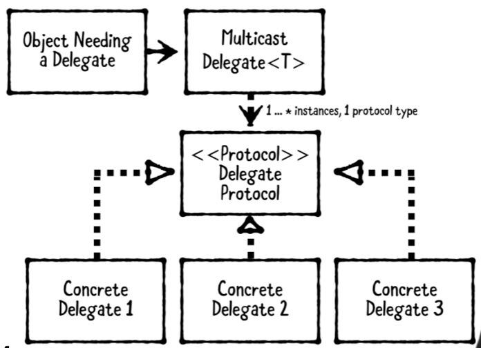 

This pattern involves four types:
- **Object needing a delegate:** The object that has one or more delegates.
- **Multicast delegate:** Helper class that holds onto the delegates and allows to notify each delegate whenever an event happens.
- **Delegate protocol:** Defines methods the delegate might or should implement.
- **Concrete delegates:** Objects that implement the delegate protocol.

### When should we use this pattern?

- When we need to create One to Many delegate relationships. (For example when we need to notify multiple consumers whenever a change happens on another object.) Each delegate can then update its state or perform relevant actions in response.

<pre>
This pattern works best only to inform to delegates "calls". It doesn't work well the other way around because if asking the delegates for data it could result on duplicate information or too much processing. Instead, consider <strong style="color: #A9DFBF;">chain-of-responsibility pattern</strong>.
</pre>

### Basic Example

#### MulticastDelegate<T> custom class

```swift
public class MulticastDelegate<T> {
  
  // MARK: - DelegateWrapper
  private class DelegateWrapper {
    
    weak var delegate: AnyObject?
    
    init(_ delegate: AnyObject) {
      self.delegate = delegate
    }
  }
  
  // MARK: - Instance Properties
  public var delegates: [T] {
    delegateWrappers = delegateWrappers.filter { $0.delegate != nil }
    return delegateWrappers.map { $0.delegate! } as! [T]
  }
  private var delegateWrappers: [DelegateWrapper] = []
  
  // MARK: - Object Lifecycle
  public init() { }
  
  // MARK: - Delegate Management
  public func addDelegate(_ delegate: T) {
    let wrapper = DelegateWrapper(delegate as AnyObject)
    delegateWrappers.append(wrapper)
  }
  
  public func removeDelegate(_ removeDelegate: T) {
    guard let index = delegateWrappers.firstIndex(where: {
      $0.delegate === (removeDelegate as AnyObject)
    }) else {
      return
    }
    delegateWrappers.remove(at: index)
  }
  
  public func invokeDelegates(_ closure: (T) -> ()) {
    delegates.forEach { closure($0) }
  }
}
```

### Multicast Delegate in action

```swift
// MARK: - Delegate Protocol
public protocol EmergencyResponding {
  func notifyFire(at location: String)
  func notifyCarCrash(at location: String)
}

// MARK: - Delegates
public class FireStation: EmergencyResponding {
  public func notifyFire(at location: String) {
    print("Fire fighters were notified about fire at " + location)
  }
  
  public func notifyCarCrash(at location: String) {
    print("Fire fighters were notified about a car crash at " + location)
  }
}

public class PoliceStation: EmergencyResponding {
  public func notifyFire(at location: String) {
    print("Police will respond to fire at " + location)
  }
  
  public func notifyCarCrash(at location: String) {
    print("Police will assist with car crash at " + location)
  }
}

// MARK: - Delegating Object
public class DispatchSystem {
  let multicastDelegate = MulticastDelegate<EmergencyResponding>()
}

// MARK: - Example
let dispatch = DispatchSystem()
var policeStation: PoliceStation! = PoliceStation()
var fireStation: FireStation! = FireStation()
dispatch.multicastDelegate.addDelegate(policeStation)
dispatch.multicastDelegate.addDelegate(fireStation)

dispatch.multicastDelegate.invokeDelegates {
  $0.notifyFire(at: "Ray's house")
}

print("")
fireStation = nil
dispatch.multicastDelegate.invokeDelegates {
  $0.notifyCarCrash(at: "Ray's garage!")
}
```


___
## Facade pattern

<pre>
🥎 This pattern is a structure pattern that provides a simple interface to a complex system.

FYI: (/fəˈsɑːd/) The principal front of a building, that faces on to a street or open space.
</pre>

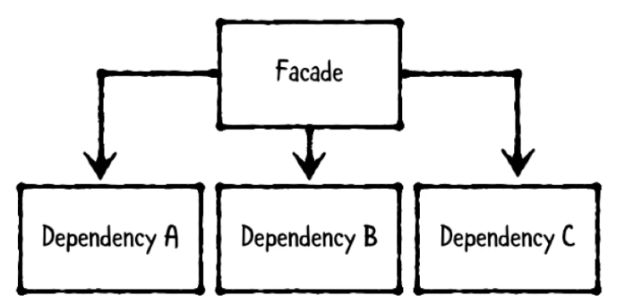 

This pattern involves four types:
- **Facade:** Provides simple methods that interacts with the system. This allows consumers to use the Facede instead of knowing or interacting with multiple classes in the system.
- **Dependencies:** Are objects own by the dacade. Each dependency performs a small part of a complex task.

### When should we use this pattern?

- Whenever there is a system made up by multiple components and want to provide a way to Users to perform complex tasks. (For example a product ordering system, that involves components such as customers, inventory stock, shipping orders etc..)

### Basic Example

```swift
import Foundation

// MARK: Some model
public struct Product {
  public let identifier: String
  public var name: String
  public var cost: Double
}

extension Product: Hashable {
  public func hash(into hasher: inout Hasher) {
    hasher.combine(identifier)
  }
  
  public static func ==(lhs: Product, rhs: Product) -> Bool {
    return lhs.identifier == rhs.identifier
  }
}

// MARK: - Customer (External item that interacts with the Facade)
public struct Customer {
  public let identifier: String
  public var address: String
  public var name: String
}
extension Customer: Hashable {
  public func hash(into hasher: inout Hasher) {
    hasher.combine(identifier)
  }
  
  public static func ==(lhs: Customer, rhs: Customer) -> Bool {
    return lhs.identifier == rhs.identifier
  }
}

// MARK: - Dependencies

// MARK: - Dependencies - InventoryDatabase
public class InventoryDatabase {
  public var inventory: [Product: Int] = [:]
  
  public init(inventory: [Product: Int]) {
    self.inventory = inventory
  }
}

// MARK: - Dependencies - ShippingDatabase
public class ShippingDatabase {
  public var pendingShipments: [Customer: [Product]] = [:]
}

// MARK: - Facade
public class OrderFacade {
  public let inventoryDatabase: InventoryDatabase
  public let shippingDatabase: ShippingDatabase
  
  public init(inventoryDatabase: InventoryDatabase,
              shippingDatabase: ShippingDatabase) {
    self.inventoryDatabase = inventoryDatabase
    self.shippingDatabase = shippingDatabase
  }
  
  public func placeOrder(for product: Product, by customer: Customer) {
    print("Place order for '\(product.name)' by '\(customer.name)'")
    
    let count = inventoryDatabase.inventory[product, default: 0]
    guard count > 0 else {
      print("'\(product.name)' is out of stock!")
      return
    }
    
    inventoryDatabase.inventory[product] = count - 1
    
    var shipments = shippingDatabase.pendingShipments[customer, default: []]
    shipments.append(product)
    shippingDatabase.pendingShipments[customer] = shipments
    
    print("Order placed for '\(product.name)' by '\(customer.name)'")
  }
}

// MARK: - Example
let rayDoodle = Product(identifier: "product-001", name: "Ray's doodle", cost: 0.25)
let vickiPoodle = Product(identifier: "product-002", name: "Vicki's prize poodle",
                          cost: 1000)

let inventoryDatabase = InventoryDatabase(inventory: [rayDoodle: 50, vickiPoodle: 1])

let orderFacade = OrderFacade(inventoryDatabase: inventoryDatabase,
                              shippingDatabase: ShippingDatabase())

let customer = Customer(identifier: "customer-001",
                        address: "1234 My Street Somwhereville, Somewhere, TX, USA",
                        name: "Johnny Appleseed")

orderFacade.placeOrder(for: vickiPoodle, by: customer)
```


## Questions and Answers
N | Question | Answer
-- | ----------- | -------------
1 | Which pattern Data sources actually follow? | Delegation pattern
2 | Which pattern enables us to change behaviors at runtime? | Strategy Pattern
3 | What is the main problem with MVC? ow can we alleviate this? | Massive view controllers. Use other patterns.
4 | When shouldn't we see the strategy pattern? | If behavior won't ever change.
5 | Which pattern allows an object to be made via a series of steps? | Builder pattern
6 | Which pattern allows one object to listen for changes on another? | Observer pattern
7 | Which pattern allows objects to be saved and restored? | Memento pattern
8 | What is the purpose of the view model? | Transforms a model into a view-representable state.
9 | What does a factory do? | Encapsulates product creation logic in a single object. Creates products.
10 | Which pattern should we use to make incompatible interfaces work together? | Adapter pattern.
11 | Which pattern should we use to support for in looping? | Iterator Pattern
12 | What happens to view controllers in MVVM? | View Controllers still exists in MVVM but the role is minimized.
13 | What is the purpose of the subject in the observer pattern? | The subject is the object that is observed for changes.

