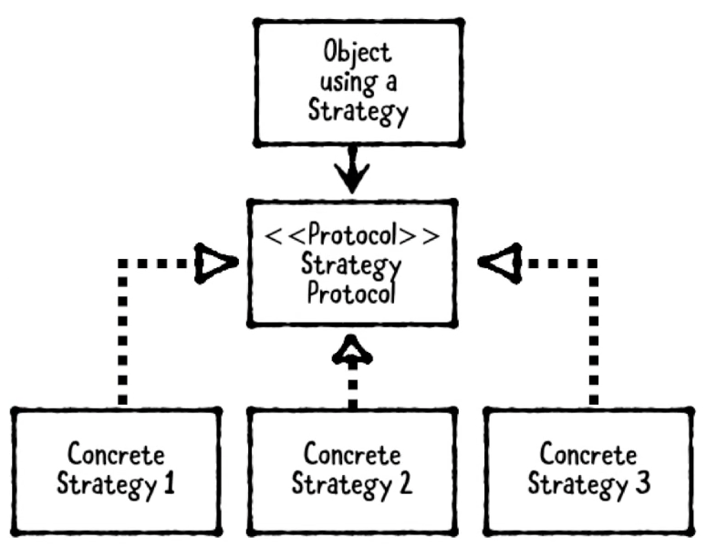

# Design Patterns For iOS Development

_This article is informative and does not have the purpose to strictly motivate developers to follow this patterns for the development of iOS applications. Neither to memorize the names mentioned in this article. However, it might be a good idea to understand them and considering using them for your particular problems._

### Types of Design Patterns.

1. **Structural**: Describe how objects are combined and composed to create complex structures. 
- MVC
- MVVM

2. **Behavioral**: Describe how objects communicate with each other.
- Delegation
- Strategy
- Observer

3. **Creational**: Describe how to create or instantiate objects.
- Builder
- Singleton
- Prototype

---
## Class Diagrams

As in this article, class diagrams are very useful for understanding Design patterns, so go through the require concepts that you already might be familiar with.

Class Diagrams include Classes, protocols, properties, methods and relationships.

Here is a class that we called Dog and a subclass SheepDog, in a class diagrams instead of saying _SheepDog inherits from Dog_ we can simply say _SheepDog is a Dog_. Makes sense right? The direction of the arrow defines de relationship. The arrows always point at the super class.

 

To indicate that a class has a property, we can use a plain arrow and it would be read as "has a". If there are multiple properties it could be read as "has one or more.."

 

Also, we could indicate multiple relationships in a single diagram.

 

Now, when we define a protocol, the right way would be adding a label "Protocol" surrounded by double brackets. 

 

This is the way we could add a class diagram to define a class that implements OR conforms to a protocol. 

 

But hold on. If we want to indicate "uses", we use a plain arrow and a dashed line. This is a relationship for **usage**, which means that indicates its purpose. 

 

We can add also add methods and properties in a class diagram.

 

Here it is a complete class diagram for a Farmer who has a SheepDog which is a Dog that delegates to the PetOwning object.

 

### Other Examples

1. Dog and Cat inherit from Animal, which defines an eat method.

 

2. Vehicle protocol has one Motor and one or more Wheel objects. Note that since the vehicle has one or more wheels an 1...* is added.

 

3. Professor is a teacher and conforms to a Person protocol. This is a bit ambiguous, so there could be two options. In the option 1 the Professor conforms to Person and Teacher also conforms to Person. In Option 2 Teacher does not conforms to Person.

Option 1 | Option 2
------------ | -------------
  |  

---
## MVC (Model-View-Controller)

The MVC separates data into 3 types:

 
<pre>
MVC is the Apple design pattern in the UIKit.
</pre>

- **Model**: Models hold onto application data. Usually Structs or simple classes.
- **Views**: Display visual elements and controls on the screen. Usually subclasses of UIView.
- **Controller**: Coordinates between Model and Views. Usually subclasses of UIViewController.

### Some rules
* Controllers are allowed to hold strong properties for the Model or View so they can access directly.
* Controllers might have one or more Models and/or Views.
* Models and Views should not hold a strong reference of the ViewController. Instead Model communicate to the Controllers through Property Observers and Views communicate to Controller by IBActions. 
* Models and Views are meant to be reusable, but Controllers not because Controllers have specific logic.

The following is a basic example where we illustrate that has been said. The Model is a basic struct that hold the data. A view could be any subclass of UIView, it is reusable. The View Controller holds a strong reference of the Model and the View, but no one owns it. The communication between the components is clear. The controller modifies the view and the model directly. The View talks to the Controller by IBActions, the View Could talk to the Controller by observers or delegates, but it will come later in this article.

```
// MARK: - Model
public struct Address {
  public var street: String
  public var city: String
  public var state: String
  public var zipCode: String
}

// MARK: - View
public final class AddressView: UIView {
  @IBOutlet public var streetTextField: UITextField!
  @IBOutlet public var cityTextField: UITextField!
  @IBOutlet public var stateTextField: UITextField!
  @IBOutlet public var zipCodeTextField: UITextField!
}

// MARK: - Controller
public final class AddressViewController: UIViewController {
  
  // MARK: - Properties
  public var address: Address? {
    didSet {
      updateViewFromAddress()
    }
  }
  public var addressView: AddressView! {
    guard isViewLoaded else { return nil }
    return (view as! AddressView)
  }
  
  // MARK: - View Lifecycle
  public override func viewDidLoad() {
    super.viewDidLoad()
    updateViewFromAddress()
  }
  
  private func updateViewFromAddress() {
    guard let addressView = addressView,
      let address = address else { return }
    addressView.streetTextField.text = address.street
    addressView.cityTextField.text = address.city
    addressView.stateTextField.text = address.state
    addressView.zipCodeTextField.text = address.zipCode
  }
  
  // MARK: - Actions
  @IBAction public func updateAddressFromView(_ sender: AnyObject) {
    guard let street = addressView.streetTextField.text, street.count > 0,
      let city = addressView.cityTextField.text, city.count > 0,
      let state = addressView.stateTextField.text, state.count > 0,
      let zipCode = addressView.zipCodeTextField.text, zipCode.count > 0
      else {
        // TO-DO: show an error message, handle the error, etc
        return
    }
    address = Address(street: street, city: city,
                      state: state, zipCode: zipCode)
  }
}

```

### Considerations

```
- Not every object fits into Model, View or Controller.
- Be careful about controllers growing too big.
- Use other patterns as needed.
```
---
## Delegation Pattern

<pre>
🥎 This pattern enables an object to use another helper object to provide data or perform a task rather than doing it itself.
🥎 The core purpose of the delegate pattern is to allow an object to communicate back to its owner in a decoupled way. By not requiring an object to know the concrete type of its owner, we can write code that is much easier to reuse and maintain.
</pre>

The delegation pattern has 3 parts:
- **Delegating Object:** The object that has the Delegate. The delegate is usually held in the delegating object as **weak property** to avoid a retain cycle where the delegating object retains the delegate which retains the delegating object.
- **Delegate Protocol:** Defines the methods that the Delegate might implement. 
- **Delegate:** The Helper Object that implements the Delegate Protocol.

 

### Basic example
```
// MARK: - Delegate
public class MainViewController: UIViewController {
    public override func viewDidLoad() {
        // Instantiate a MainViewController
        let vc = MenuViewController()
        vc.delegate = self
        navigationController?.pushViewController(vc, animated: true)
    }
}
extension MainViewController: MenuViewControllerDelegate {
    public func menuViewController(didRequestAFavour index: Int) {
        // Here I use index and do some task for MenuViewController.
    }
}

// MARK: - Delegate Protocol
public protocol MenuViewControllerDelegate: class {
    func menuViewController(didRequestAFavour index: Int)
}

// MARK: - Delegating Object
public class MenuViewController: UIViewController {

  public weak var delegate: MenuViewControllerDelegate?

  @IBAction public func updateAddressFromView(_ sender: AnyObject) {
    delegate?.menuViewController(didRequestAFavour: 1)
  }
}
```

### When should we use it?

1. To break up large classes or create reusable components.
2. In Apple frameworks datasources and delagates both use this pattern. (FYI, Datasources have delegate methods to **provide** data and delegates have delegates methods that **receive** data).
---
## Strategy Pattern

<pre>
🥎 This pattern defines a family of interchangeable objects that can be set or switch at runtime.
🥎 This pattern is similar to the Delegate pattern but, instead of defining one delegate we have a family of objects.
</pre>

 

This pattern has 3 parts.

1. **The object using the strategy:** Usually is a ViewController or any class that requires interchangeable behavior.
2. **Strategy Protocol:** Protocol that define the methods of the strategy.
3. **Strategies:** Objects that conform to the Strategy Protocol.

### When should we use it?

- When we have two or more interchangeable behaviors.
- When we need to interchange them at runtime.

### Basic Example

The following example shows this pattern in action, basically the strategies are helper classes that conform to the same protocol which means that the protocol methods will be the same but the logic in each strategy is different according to the needs. 

```
// MARK: - Strategy Protocol
public protocol MovieRatingStrategy {
  
  var ratingServiceName: String { get }
  
  func fetchRating(for movieTitle: String,
                   success: (_ rating: String, _ review: String) -> ())
}

// MARK: - Strategy 1
public class RottenTomatoesClient: MovieRatingStrategy {
  public let ratingServiceName = "Rotten Tomatoes"
  
  public func fetchRating(
    for movieTitle: String,
    success: (_ rating: String, _ review: String) -> ()) {
    
    // In a real service, you'd make a network request...
    // Here, we just provide dummy values...
    let rating = "95%"
    let review = "It rocked!"
    success(rating, review)
  }
}

// MARK: - Strategy 2
public class IMDbClient: MovieRatingStrategy {
  public let ratingServiceName = "IMDb"
  
  public func fetchRating(
    for movieTitle: String,
    success: (_ rating: String, _ review: String) -> ()) {
    
    let rating = "3 / 10"
    let review = """
      It was terrible! The audience was throwing rotten
      tomatoes!
      """
    success(rating, review)
  }
}

import UIKit

// MARK: - Object Using the Strategy
public class MoviewRatingViewController: UIViewController {
  
  // MARK: - Properties
  public var movieRatingClient: MovieRatingStrategy!
  
  // MARK: - Outlets
  @IBOutlet public var movieTitleTextField: UITextField!
  @IBOutlet public var ratingServiceNameLabel: UILabel!
  @IBOutlet public var ratingLabel: UILabel!
  @IBOutlet public var reviewLabel: UILabel!
  
  // MARK: - View Lifecycle
  public override func viewDidLoad() {
    super.viewDidLoad()
    ratingServiceNameLabel.text =
      movieRatingClient.ratingServiceName
  }
  
  // MARK: - Actions
  @IBAction public func searchButtonPressed(sender: Any) {
    guard let movieTitle = movieTitleTextField.text
      else { return }
    
    movieRatingClient.fetchRating(for: movieTitle) {
      (rating, review) in
      self.ratingLabel.text = rating
      self.reviewLabel.text = review
    }
  }
}
```

---
## Singleton Pattern

<pre>
🥎 This pattern restricts a class to a single instance. Every reference to the class refers to the same underlined instance.
</pre>

 

### When should we use it?

- When it makes sense to have a shared instance of the same class alive all the time and available from any other class.
- Sometimes is useful to have share instance but with a bit of difference. In this case a singleton with custom instances capability could be created. This is called Singleton Plus.

### Basic Example

```
// MARK: - Singleton
public class MySingleton {
  static let shared = MySingleton()
  private init() { }
}

let mySingleton = MySingleton.shared


// MARK: - Singleton Plus

public class MySingletonPlus {
  static let shared = MySingletonPlus()
  public init() { }
}

let singletonPlus = MySingletonPlus.shared
let singletonPlus2 = MySingletonPlus()
```

### Cautions

- Be careful, this pattern is very easy to be overused. **Don't make it the first option to accomplish a task.**
- Don't use it for passing data.
- Singletons make testing harder.
- Be aware of "code smells" indicating you don't need a singleton.
- SIngleton Plus might not be a good idea. Consider using simple class objects.


